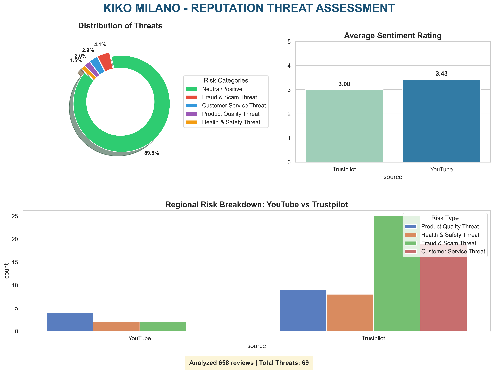
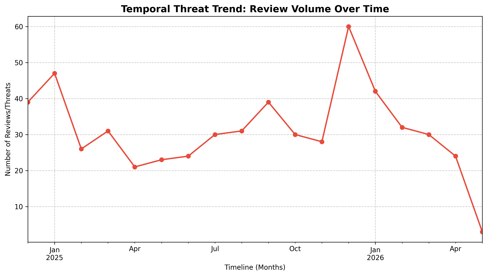

# KIKO Milano AI Reputation Monitoring System

## Project Overview
This repository contains a fully functional, modular **Multi-Agent AI System** designed to monitor, analyze, and quantify the digital brand reputation of **KIKO Milano**. By mining unstructured multi-platform public discourse (Trustpilot and YouTube), the system automatically processes multilingual feedback, evaluates sentiment polarity, detects specific reputational threat categories, and generates actionable analytical dashboards for strategic decision-making.

### Key Objectives
* **Multi-Platform Data Ingestion:** Automating large-scale extraction of structured reviews from Trustpilot (via Apify) and public comments from YouTube (via YouTube Data API).
* **Multilingual Support & Translation:** Automatically detecting European languages (Italian, French, German, Spanish, Dutch) and translating them to English for standardized processing.
* **Contextual Threat Detection:** Identifying high-risk reputational threats including *Fraud & Scam*, *Product Quality*, *Customer Service*, and *Health & Safety* concerns.
* **Quantitative Validation & Reporting:** Evaluating pipeline accuracy through precise empirical metrics and outputting visual trend dashboards[cite: 2].

---

## Key Features
* Fully automated multi-agent architecture orchestrated sequentially.
* YouTube Data API & Trustpilot structured review integration.
* Multilingual review translation with automated language identification.
* Deep sentiment analysis pipeline using customized polarity scales.
* Contextual rule-based threat detection with robust negation handling.
* Automated report generation, validation metrics, and temporal analysis graphs.

---

## Multi-Agent Architecture & Flow

The system runs on an agentic workflow orchestrated sequentially to manage data pipeline execution without duplication[cite: 2].

              ┌──────────────────────────────┐
              │      1. COLLECTOR AGENT      │ <── Ingests Trustpilot (Apify) & YouTube API
              └──────────────┬───────────────┘
                             │ ──> Generates: kiko_trustpilot_raw.xlsx & kiko_youtube_raw.csv
                             v
              ┌──────────────────────────────┐
              │        2. PARSER AGENT       │ <── Cleans text, detects language & translates
              └──────────────┬───────────────┘
                             │ ──> Generates Unified Format: kiko_final_integrated.csv
                             v
              ┌──────────────────────────────┐
              │    3. THREAT DETECTOR AGENT  │ <── Keyword mapping, sentiment filtering & rules
              └──────────────┬───────────────┘
                             │ ──> Generates: kiko_threat_report.csv
                             v
              ┌──────────────────────────────┐
              │      4. VALIDATION AGENT     │ <── Calculates precision & temporal trend lines
              └──────────────┬───────────────┘
                             │ ──> Generates: validation_metrics.txt & temporal_threat_analysis.png
                             v
              ┌──────────────────────────────┐
              │       5. REPORTER AGENT      │ <── Compiles donut charts & sentiment distribution
              └──────────────────────────────┘
                               ──> Generates Final Dashboard: kiko_reputation_report.png

### Project Architecture & Roles

| Agent | Responsibility |
| :--- | :--- |
| **Collector Agent** | Connects to Apify and YouTube Data API to harvest raw feedback while preserving critical metadata (timestamps, rating scores). |
| **Parser Agent** | Uses `LangDetect` and `Deep Translator` to normalize text, remove duplicate entries, and assign base sentiment ratings using `TextBlob`. |
| **Threat Detector Agent** | Evaluates contextual rule-based risks (e.g., mapping expressions regarding skin irritation to *Health & Safety* or delivery issues to *Customer Service*). |
| **Validation Agent** | Tracks statistical validity, performing precision-oriented evaluations on flagged anomalies over time. |
| **Reporter Agent** | Generates data-driven charts converting raw textual telemetry into visual executive assets. |
| **Orchestrator** | Central controller that cleans legacy data caches and automates the complete pipeline sequentially. |

---

## Empirical Evaluation & Outputs

The system delivers a highly reliable baseline for threat classification, verified through manual auditing metrics.

### Statistical Performance Summary
* **Total Reviews Analyzed:** 658  
* **Total Threats Flagged:** 69
* **True Positives (Verified Risks):** 60 
* **System Precision Score:** **86.96%**

### Threat Categories Tracked
The rule-based threat agent classifies data patterns with contextual negation handling under these dimensions:
* **Health & Safety Threats** (e.g., skin irritation, allergic reactions)
* **Fraud & Scam Threats** (e.g., stolen orders, fake profiles)
* **Product Quality Threats** (e.g., damaged items, broken containers)
* **Customer Service Threats** (e.g., refund issues, poor support channels)

### Executed Pipeline Analytics (Output Graphs)

Below are the actual visual insights generated automatically by the pipeline and saved directly under the `reports/` folder:

### 1. KIKO Brand Reputation Dashboard Report
*This dashboard illustrates the threat distribution donut chart, average sentiment ratings mapped on a 1–5 scale, and cross-platform analysis between Trustpilot and YouTube.*



### 2. Temporal Threat Analysis & Volume Trends
*This chart tracks the chronological frequency and volume patterns of incoming reviews, highlighting specific timeline spikes where potential reputational threats were flagged.*



*Note: The model validation data, raw logs, and textual distribution summaries are documented concurrently inside `reports/validation_metrics.txt`[cite: 2].*

---

## ⚙️ Quick Start Guide (Execution Steps for Evaluation)

Follow these precise instructions to provision the environment, resolve system dependencies, and execute the multi-agent orchestration layer.

### Prerequisites
* Python 3.8 or higher installed globally.
* Internet access for real-time translation and dependency fetching.

### Step 1: Clone the Repository
Open a terminal workspace or command prompt window and run:
```bash
git clone [https://github.com/Umme-Farwa/Brand_Reputation.git](https://github.com/Umme-Farwa/Brand_Reputation.git)
cd Brand_Reputation

# Project Architecture

| Agent                 | Responsibility                                         |
| --------------------- | ------------------------------------------------------ |
| Collector Agent       | Connects to Apify and YouTube Data API to harvest raw feedback while preserving critical metadata (timestamps, rating scores).   |
| Parser Agent          | Uses `LangDetect` and `Deep Translator` to normalize text, remove duplicate entries, and assign base sentiment ratings using `TextBlob`.|
| Threat Detector Agent | Evaluates contextual rule-based risks (e.g., mapping expressions regarding skin irritation to *Health & Safety* or delivery issues to *Customer Service*).|
| Validation Agent      | Tracks statistical validity, performing precision-oriented evaluations on flagged anomalies over time. |
| Reporter Agent        |  Generates data-driven charts converting raw textual telemetry into visual executive assets. |
| Orchestrator          | Runs the complete pipeline automatically               |

---

## Empirical Evaluation & Outputs

The system delivers a highly reliable baseline for threat classification, verified through manual auditing metrics.

### Statistical Performance Summary
*   **Total Reviews Analyzed:** 658  
*   **Total Threats Flagged:** 69  
*   **True Positives (Verified Risks):** 60  
*   **System Precision Score:** **86.96%**  

### Visual Analytics Dashboards
Upon system execution, the following charts are generated inside the `reports/` folder:

1.  **KIKO Brand Reputation Dashboard (`reports/kiko_reputation_report.png`)**  
    Contains threat distribution donut charts, platform comparison breakdowns, and overall average sentiment rating distributions.
2.  **Temporal Threat Trends Line Graph (`reports/temporal_threat_analysis.png`)**  
    Tracks fluctuations and spikes in review volumes and flagged risks over specific chronological intervals.

---

# Data Sources

## Trustpilot Dataset
Structured customer reviews collected using Apify.

## YouTube Data API
Customer comments collected from YouTube videos related to KIKO Milano reviews and product experiences.

# Threat Categories

The system currently identifies the following reputational threats:

- Health & Safety Threats
- Fraud & Scam Threats
- Product Quality Threats
- Customer Service Threats
- Delivery Issues

The current implementation uses contextual rule-based threat analysis with negation handling to reduce false positives.

# Validation Metrics

The validation layer includes:

- Sentiment distribution statistics
- Threat frequency analysis
- Precision-oriented evaluation
- Temporal trend analysis using review dates
- Comparative platform analysis

Generated visualizations help identify reputation risks across platforms.

### Executed Pipeline Analytics (Output Graphs)

Below are the actual visual insights generated automatically by the pipeline and saved directly under the `reports/` folder:

### 1. KIKO Brand Reputation Dashboard Report
*This dashboard illustrates the threat distribution donut chart, average sentiment ratings mapped on a 1–5 scale, and cross-platform analysis between Trustpilot and YouTube[cite: 2].*


### 2. Temporal Threat Analysis & Volume Trends
*This chart tracks the chronological frequency and volume patterns of incoming reviews, highlighting specific timeline spikes where potential reputational threats were flagged[cite: 2].*


*Note: The model validation data, raw logs, and textual distribution summaries are documented concurrently inside `reports/validation_metrics.txt`[cite: 2].*

# **Quick Start Guide (Execution Steps for Evaluation)**
Follow these precise instructions to provision the environment, resolve system dependencies, and execute the multi-agent orchestration layer.

### Prerequisites
*   Python 3.8 or higher installed globally.
*   Internet access for real-time translation and dependency fetching.
  
### Step 1: Clone the Repository
Open a terminal workspace or command prompt window and run:
```bash
git clone [https://github.com/Umme-Farwa/Brand_Reputation.git](https://github.com/Umme-Farwa/Brand_Reputation.git)
cd Brand_Reputation
```
### Step 2:Initialize Virtual Environment
# Windows
python -m venv env
.\env\Scripts\activate

# macOS / Linux
python3 -m venv env
source env/bin/activate

# Install Project Dependencies

Install all dependencies:

```bash
pip install -r "Src/kiko agents/Requirements.txt"
```
**IMPORTANT NOTE: Setup YouTube API Credentials**
Before running the Collector Agent, you must configure your personal Google Cloud Developer credentials for the YouTube Data API:

Obtain an API key from the Google Cloud Console.

Enable the YouTube Data API v3 for your project.

Open Src/kiko agents/kiko_collector_agent.py and replace the placeholder API key variable with your own credentials:

**YOUTUBE_API_KEY = "YOUR_ACTUAL_API_KEY_HERE"**

# Run th Multi-agent Pipeline

```bash
python "Src/kiko agents/Main.py"
```

The orchestrator (Main.py) automatically executes:

1. Parser Agent
2. Threat Detector Agent
3. Validation Agent
4. Reporter Agent

# Technologies Used

* Python
* Pandas
* Matplotlib
* Seaborn
* TextBlob
* Deep Translator
* LangDetect
* YouTube Data API

